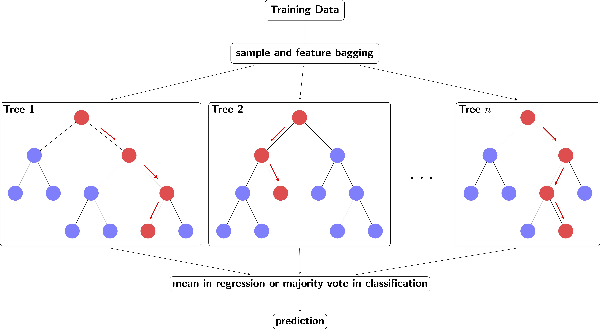

The prizes in snooker can be sometimes ridiculously huge so why don't we use data science to predict some?


# Snooker Prizes
This project's goal is to **predict snooker players' money prizes in whole season basing on his achievements**.

It's a web application, which downloads data from online resources and perform predictions. 

## Web scraping
The code uses Python's ```requests``` to fetch data and ```BeautifulSoup``` to scrap it - downloaded HTML code is being searched for particular blocks (e.g. find all ```div``` tags of class ```abc123```). 

Pros:
> It's very fast

Cons:
> It's very vulnerable for any format changes on the website (for instance changes in page layout or renamed tag classes).

To prevent this vulnerability at least a bit, all links are configurable as a part of CueTracker.py in Links class:

```
class Links(Enum):
    CENTURIES = "centuries/most-made/"
    TITLES = "tournaments/won/"
    TOURNAMENTS_AND_MATCHES = "matches-and-frames/won/"
    MONEY = "prize-money/won/"
```

## Data
All of data is being downloaded from https://cuetracker.net - a website with loads of snooker data. This is done dynamically, whenever the program is running. This could be optimized by downloading the data every interval (e.g. every 1 week or 1 month) and save it on disc space.

> Since the data could be heavy (e.g. whole HTML code) some of the variables are deleted from memory right after their usage.

## Predictions
To predict money prizes a Random Forest model has been used. 



Random forest model is a combination of multiple decision trees. The algorithm randomly chooses features, randomly chooses sample from training set and builds a decision tree. Then it repeats the process multiple times. When all trees (i.e. a forest) are created, the model is ready. Predictions are being made by passing a piece of data through the whole forest and calculate mean from produced values.

There are few parameters that should be tuned within Random Forest model:
* ```max_features``` - the maximum number of features that will be used in every single decision tree. It affects performance: the bigger a value is, the algorithm works slower, but the results will be more accurate.
* ```min_samples_leaf``` - the minimum number of samples required to be at a leaf node. This parameter is similar to ```min_samples_splits```.
* ```n_estimators``` - number of trees in the forest. It affects performance as well.
* ```bootstrap``` - boolean parameter to specify if bootstraping will be used (it means that the observations within one sample can occur more than once). If ```False```, standard subsampling will be used.

The model performs quite well, since the accuracy (computed with Cross Validation) is more than 80%, despite quite small data sample . 

## Variables
 * "Name" - player's first name and last name, could be used as an index
 * "Centuries" - how many times player achieved a break with at least 100 points,
 * "T_Played" - how many tournaments player has taken part in,
 * "M_Played" - how many matches player has played,
 * "M_Won" - how many matches player has won,
 * "Titles" - how many tournaments player has won,
 * "Money" - sum of all money prizes (target variable).
 
All values are applicable for chosen seasons. 

# Web app
The frontend and routing logic have been developed with ```Flask```, which is a framework designed specifically for simple web apps.

## Libraries
 * ```BeautifulSoup``` - to parse and scrap HTML code.
 * ```Pandas```/```NumPy``` - to prepare data for use in DataFrame format.
 * ```sklearn``` - to perform predictory computations.
 * ```requests``` - to call HTTP methods on specifil URL. ```Selenium``` solution is also possible, but since it would require much more development, ```requests``` lib has been used.

## Hosting
The project is ready to be hosted using Heroku.
